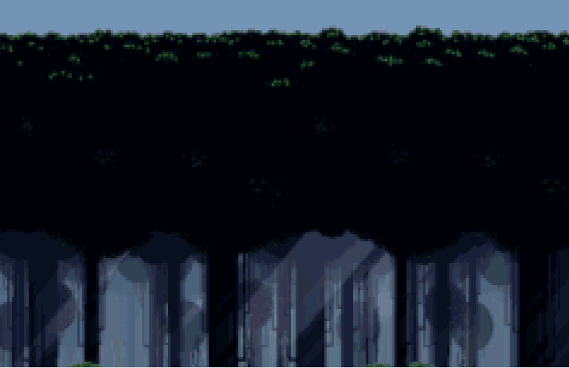

# Bouncers
An exercise to learn about functions and classes.
# 🌿 Firefly Bouncers

A Game Boy Advance game built with [Butano](https://github.com/GValiente/butano) where glowing fireflies bounce around a moonlit forest.



---

## 🎮 How to Play

| Button | Action |
|--------|--------|
| **A**  | Spawn a new firefly |
| **B**  | Log the average X position of all fireflies to the console |

Spawn as many as 20 fireflies and watch them bounce around the forest, each with their own random speed and direction!

---

## ✨ Features

- **2D Bouncing** — Each firefly moves in both X and Y directions, bouncing off all four edges of the screen
- **Randomized Movement** — Every firefly spawns with a unique random speed and direction so no two behave the same
- **Forest Theme** — A pixel art forest background with a glowing firefly sprite
- **Up to 20 fireflies** on screen at once

---

## 🛠️ Built With

- [Butano](https://github.com/GValiente/butano) — A modern C++ high level GBA development framework
- C++
- devkitARM toolchain

---

## 🚀 Play It Live

👉 [Play on GitHub Pages](https://YOUR_GITHUB_USERNAME.github.io/YOUR_REPO_NAME)

---

## 📁 Project Structure

```
bouncers/
├── graphics/
│   ├── background.bmp   # Forest background
│   ├── background.json
│   ├── firefly.bmp      # Firefly sprite
│   └── firefly.json
├── src/
│   └── main.cpp
└── README.md
```

---

## 📝 Credits

- Forest background from [Free Pixel Art Forest by edermunizz](https://edermunizz.itch.io/free-pixel-art-forest)
- Firefly sprite created with Python Pillow
- Built as an assignment for SDEV at Green River College
Please find instructions in [instructions.md](instructions.md).
